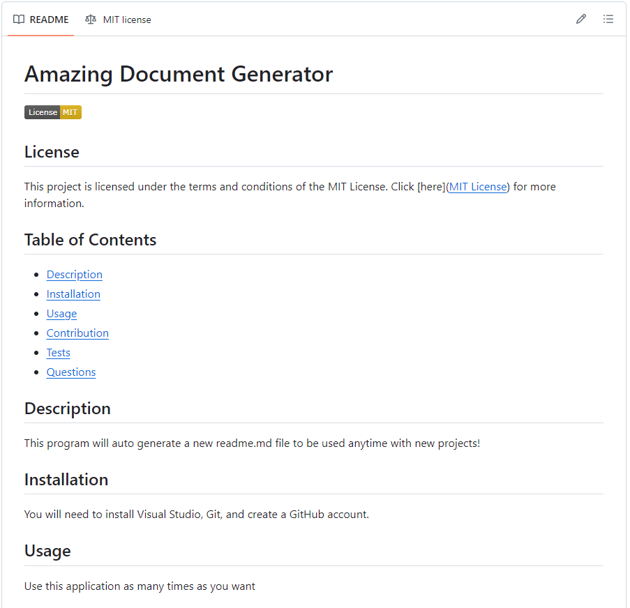

# README.md Generator

## Link to GitHub Repository:
https://github.com/FullPersonDev/readmegenerator

## Link to Demo Video:
https://drive.google.com/file/d/1f2PTU6ehiNiI8mve9y1EefpF1e0xEnXr/view

## Description:
This is a README.md generator that will automatically create a read me file for you based on question prompts provided in the terminal.

- Here is an image of what the fully completed readme file looks like after it is generated:

